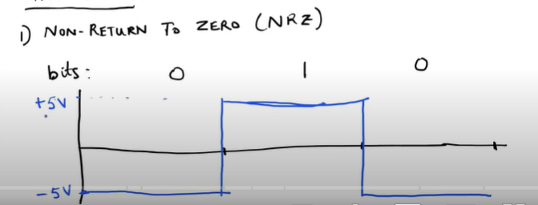
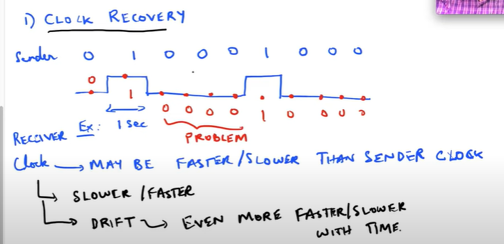
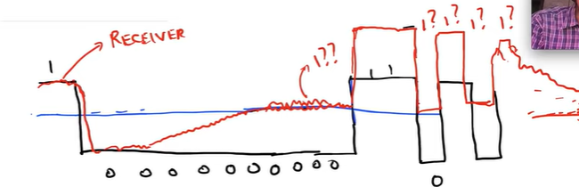
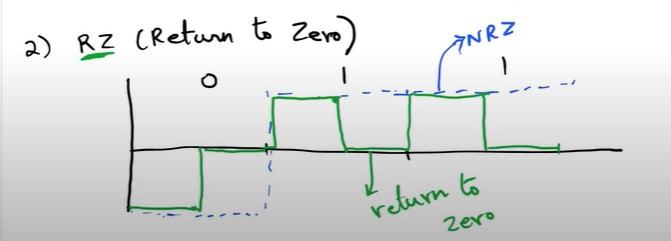
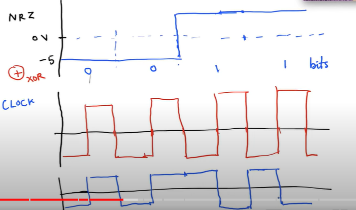
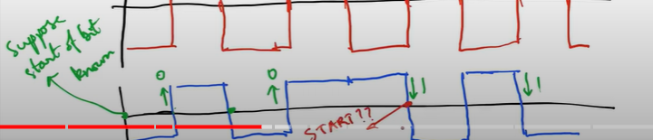

# Signalling
- Goal is to convert bits to signals

## Wired:
- Term used is line coding - in wireless, the term used is moduclation
1. **Non-Return to Zero (NRZ)**: 

2. Issues with NRZ:
- Clock Recovery: Receiver's clock may be faster or slower than the sender's clock - no perfect clock - also have drift - may get even faster or slower with time

- Baseline Wander: Signal might have a little offset due to faulty amplifier (DC Offset) - and also might corruspted with noise

- To get rid of the DC Offset - The receiver needs to have a **HIGH PASS FILTER** - low frequencies will be attenuated - DC offset is attenuated out

- A continuous string of 0's is thought of as a DC offset and is attenuated

- **Return to Zero (RZ):** go back to zero in the middle of the bit - no problm of mistaking a signal (bit signal) as DC signal and offsetting it

- But problem is it has 3 levels of signal

- **Manchester Coding (Ethernet IEEE 802.3):** 
    1. We start with NRZ and a clock (with double the frequency) and XOR those 2 - in every bit transmission there is a transition (NO DC OFFSET) and no use of 3 levels

- How to identify the output? 
    - The start of the bit
    - Polarity of the output (no flipping of wires to be done)
    - The transition of the output
        1. Downtransition: corresponds to 1
        2. Uptransition: corresponds to 0

        

- How to know that the output bitstring is starting? -** PREAMBLE** - known signal which helps the receiver synchronyze in some way with the receiver

### Preamble
Can be thought of as a physical layer header

## Differential Manchester Coding (IEEE 802.5 - Token Ring LANS)
1. **When the bit = 0:** First half of the bit is opposite of the last half of the previous bit 
2. **When the bit = 1:** First half of the bit is same as the last half of the previous bit
- **the output is flipping from the first to the seconf half of the signal within a bit**
- Advantage over manchester encoding:
    - **No need to keep the polarities** of the wires correct
    1. When the output signal remains constant for the duration of a bit, the output = 1
    2. When the output signal flips within the duration of a bit, the output = 0

## 4B/5B coding
- We can get over the problem of NRZ (DC Offset) even without using a clock
- We can take the data bits and send it through a coding scheme, which are sent
- Encoding takes 4 Bits (4B) as input and outputs 5 bits (5B) - to ensure no repeated bits occur consecutively - **ensures at most 3 consecutive 0's in the coded bit string**
- Disadvantage: 
    1. Every 5 bits corresponds to 4 bits of information - less effeciency

# Baud Rate
1. **Bit Rate:** Maximum number of bits transmitted per second
2. **Baud Rate:** Maximum number of distinct **symbol changes** made to the transmission medium per second - each level is considered 1 symbol

## Importance of Baud rate
Baud Rate - measuring how effeciently I am using the wire

### Frequency Domain
1. All the ranges of frequency are not usable - for higher freq. attenuation becomes too high
2. Given this maximum limit, how much information can I pass through the wire - related to the **baud rate**

3. Convert signal from time domain to frequency domain - if too much of the signal goes beyond the maximum limit ($f_0$) then information loss - we want to make the baud rate close to this frequency ( $f_0$ )

- Manchester encoding - higher Baud rate than the bit rate - due to clock introduced
- NRZ encoding - same Baud rate as the Bit rate

