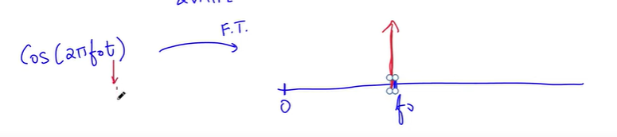
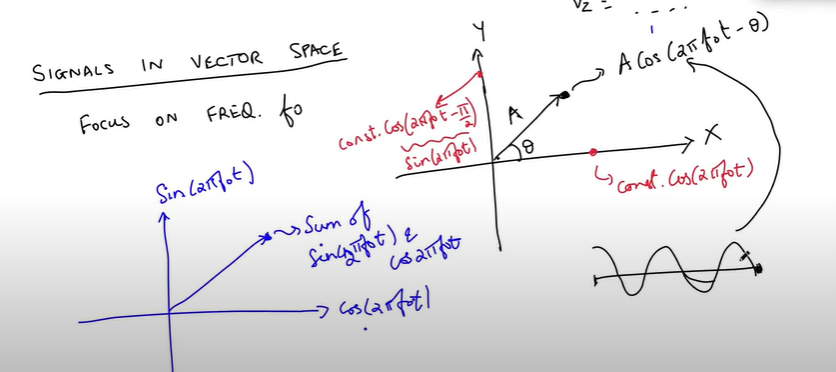
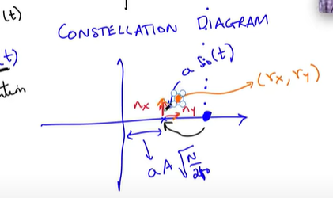
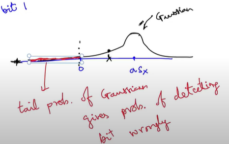

# Modulation
## How to solve the problem of interference?
1. Take a **band pass filter** at the receiver
2. The govt. auctions a range of frequencies

## How to get a signal within a particular band?
1. Fourier transform of sin wave - no information is being passed - we have to change the information in some way

2. One way is **carrier signal** - change:
    - Amplitude (AM)
    - Frequency (FM) - analog communication - signal varying over time
    - phase  - digital  - particular phase to indicate 0 and 1

3. Phase modulation:
    - 0 for bit 0
    - $\pi$ for bit 1
    - if you **change phase more often** then the fourer transform will be **wider** around central frequency $f_0$
    - if phase is less oftenly changed:
        - we are sending less information per wave 
        - but we are sending information in a much narrower band
        - if less band width is given, then less data rate is possible
    
# Bit Error Rate
1. Suppose transmitted signal is $S(t)$
2. Most General Case:
    - received signal has direct LOS component
    - also reflections add more components
    
$$r(t) = \sum_{i} a_i S(t - \tau_{i}) + n(t)$$

a_i - attenuation of one reflected component

$\tau_{i}$ - delay of a specific signal

r(t) is the received signal

n(t) - **additive white Gaussian noise** - due to the internal circuitary

3. Bit eror rate: Fraction of transmitted bits received in error - want to be as close to 0 as possible

## Vector spaces (way to think about the bit error rate)
We can write the signals in a vector space (functional analysis)- similar to fourier analysis

1. Any point in the vector space (A, $\theta$): Acos(2 $\pi f_0t - \theta$ ) - can represent the signa - sent and received different
2. Is there an analogue of the dot product?
- Any vector can be represented as sum of sin and cosine (on y and x axis respectively)
- Dot product is an integral
- Suppose I have 2 functions - f(t) and g(t) from $[0,T]$. Dot product is defined as (ignoring the complex conjugate):

$$ \lang f(t), g(t) \rang = \int_{0}^{T} f(t)g(t) dt $$

How to find the x and y components of the signal?
- find the dot product with c.cos(2 $\pi f_0 t$ ) and c.sin(2 $\pi f_0 t$ ) (c is a constant)

How to find the constant c?
$$ \lang c.cos(2 \pi f_0 t ), c.cos(2 \pi f_0 t ) \rang  = 1 $$
for T = $\frac{N}{f_0}$,
$$ c = \sqrt{\frac{2}{T}} = \sqrt{\frac{2f_0}{N}}$$

So, 
$$ \hat{e_x} = \sqrt{\frac{2f_0}{N}} cos(2 \pi f_0 t ) $$
$$ \hat{e_y} = \sqrt{\frac{2f_0}{N}} sin(2 \pi f_0 t ) $$

## Calculating the Bit error rate
Let $r(t)$ be the attenuated signal (ignoring the reflected multipath components) + the Gaussian Noise

$$ r(t) = a.s(t) + n(t) $$

a = attenuation 

n = AWGN

$$ r_x(t) = a \lang s(t), e_x \rang + \lang n(t), e_x \rang $$
$$ r_y(t) = a \lang s(t), e_y \rang + \lang n(t), e_y \rang $$

1. the signal is g(t) = $ Acos(2 \pi f_0 t - \theta)$ then $g_x = A\sqrt{\frac{N}{2f_0}}cos(\theta)$ and $g_y = A\sqrt{\frac{N}{2f_0}}sin(\theta)$

2. Let's say that the transmitted wave is 
- s(t) = $ Acos(2 \pi f_0 t )$ for bit 0 (for one time period 0 < t < T)
- s(t) = $ -Acos(2 \pi f_0 t )$ for bit 1 (for one time period)
- This is called - **Constellation diagram**- shows the signals transmitted in a vector space
- What is going to happen at the receiver?
    - the signal amplitude will reduce 
    - The noise components ( $ n_x , n_y $ ) are drawn from  Gaussian dist.
    - $ r_x = a.s_x + n_x $
    - $ r_y = a.s_y + n_y $

    

- Detection at the Receiver
    - Calculate $r_x$ and $r_y$ - build a circuit to do this
    - Find which constellation point is closest to $(r_x, r_y)$
    - What is the probability that I send one signal but the receiver gets another signal - tail probability of Gaussian distribution

    

    - Ans: Prob( $n_x > a.s_x$ )
    
- **Signal to Noise Ratio:**
$$ SNR = \frac{Signal Power}{Noise Power} $$
which is going to tell us what the bit error rate is going to be

## Modulation Schemes

### Binary Phase Shift Keying (BPSK)
- Both the constaellation points are $\pi$ out of phase with each other

### QPSK - Quadrature Phase Shift Scheme
- Four signals can be sent
- Each signal is assigned a pair of bits
- Bits hae to assigned carefully ( (0,0) and (1,1) are put in opposite quadrature because if kept in adjacent quadrants, then if error occurs - then we get both the bits wrong - the chance of error in opposite qudrants is small)
- take pairs of bits and transmit corresponding constellation point. Detect bits as before (which constellation point is closest to)

### Why do we not use 8 or 16 (Phase Shift Scheme) (QAM 16)?
- The constraints are:
    - The energy transmitted should be as low as possible (govt. has ordered to constrain the energy below a certain level) 
- Aim: send as many constellation as possible

### What constellation should be used in practice?
- Depends on 2 factors:
1. Allowed transmit power - regulated by govt.
2. Received signal power - attenuation and the noise

- Bit Error rate is a function of SNR
- Suppose the attenuation is fixed and the received power is same
    - QPSK - Lower Bit Error Rate because points are well spread
    - QAM-16 - Higher Bit Error Rate because the **received power** is the same and the **points are squished together** on the vector space

- The **modulation rate** (rate at which information is being sent) for BPSK < QPSK < QAM-16 

- Eg. closer to the wifi access point, the data rates are higher because the wifi card inside judges the SNR 
    - Higher SNR $\rightarrow$ lower BER
    - Lower BER $\rightarrow$ we can use QAM-16 rather than QPSK - which gives higher data rates

    

