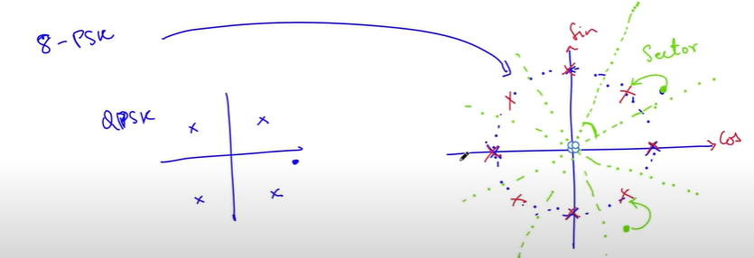

# Modulation Continued
- When Physical layer gets bits from the higher layers, it will spit out signals and vice versa

## Carrier Signal
We change the:
- Amplitude
- Phase 
- frequency - most high speed systems will not change frequency

## Constellation Diagram
- term used for a signal sent in a constellation diagram is a **symbol**
- The final signal transmitted is a concatination of the different symbols ($ S_{00}, S_{01} \ etc$)
- What we receive is $ r(t) = a.s(t) + n(t) $ attenuation + noise
- We look at the x and y components of what we receive

## Other Modulation Schemes 
### 8-PSK
- Not same as QAM (In which amplitude also changed)
- All of them have the same amplitude
- The plane gets divided into **sectors**
- We want to spread the symbols reasonably far apart

- the **advantage of PSK** is that Amplitude does not come into picture (unlike QAM) - we do not need to know the attenuation (to a very good degree of error)
- Same amplitude might simplify circuits
