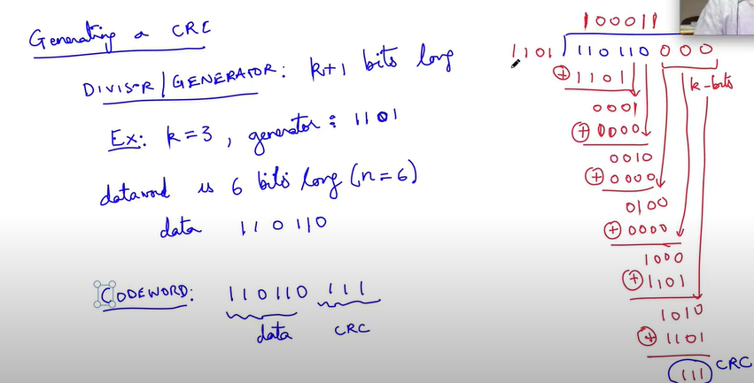
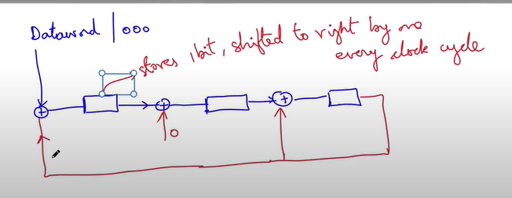

# Data Link Layer
- At DLL we try to make some sense of the bits coming in from the physical layer
- Which bits together mean something together?
- The term used for the data unit is **frames** - at the DLL
- The term used for the data unit at the Network Layer - **packet**
- The term used for data unit at the Transport Layer - **Segments**
- Effectively, each of the entity is a group of bits - minimum number of bits together which make sense at that layer

## Frames
1. We need to specify the start and end 

Eg. 
1. **HDLC: High level data link control** - Layer 2 Technology (DLL) in Wide Area Networks - covers larger geographical area than LAN

- The frame has (in the same sequence)
    - **Begin sequence** - 8 bits long - will tell when the frame is beginning
    - **Header** - 16 bits
    - **Body** - variable length
    - **CRC** - extra bits to help verify that there are no errors in the received bits - some limitations - cannot detect all the errors - 16/32 bits
    - **End sequence** - 8 bits

- **Begin sequence and End sequence are the same - 0 111 111 0 = SEQ**
1. if there is no data, you keep sending SEQ, SEQ, SEQ,..... - helps in **clock synchronization**
2. Once there is data to send, attach the header (SEQ SEQ SEQ Header....Body, CRC, SEQ (End))
3. What if SEQ occurs in the BODY? - the link layer has to change it in suh a way that it does not cause confusion - **bit stuffing** - insert some bit in the SEQ - to change the SEQ, to ensure that SEQ does not occure - do not forget to remove thi extra bit

### Bit Stuffing (Algorithm)
1. If you see 5 consecutive 1's then insert 0 after them
2. Receiver has to remove these bits 
3. At Receiver: 
- you are not going to have 6 consecutive 1's 
- whenever you have 5 1's, the 0 after that is the extra 0 inserted

    - Assuming **no bit error**:remove 0 after 5 consecutive 1's
    
- No bit stuffing at the end sequence because it is not part of frame - suppose we reach to a 1 after 5 consecutive 1's, then END SEQ has occurred

After 5 consecutive 1's:
1. 0 $\Rightarrow$ assume due to bit stuffing and remove
2. 10 $\Rightarrow$ assume END SEQ
3. 11 $\Rightarrow$ assume that error has occured and **discard the entire frame** - everything until we see SEQ again

This will not take care of all the errors

### CRC (Cyclic Reduncdancy Check)
Does a sort of coding for us
1. Start witha **Dataword** (in out case the header and the body) - n bits - append to it a CRC which is of k bits = entire thing put together is called **codeword**

$$ codeword = dataword + CRC $$

2. Space of datawords -  n bit words - all possible combinations of datawords ($2^n$ datawords)
3. Space of codewords - (n+k) bit words - much larger space - all possible combinations of codewords ($2^{(n+k)}$ codewords) - but **not all of them are valid** codewords
4. Once we fix the CRC - only $2^n$ of the codewords are valid - every dataword corresponds to one codeword in the space of (n+k) bits

How does that help?

1. If an invalid codeword is received at the other end - then we know that an error has occured
2. What if one codeword changes to another codeword? 
    - Then we cannot do anything
    - We have to design the codewords (valid) such that they are far apart in the space of (n+k) bits 
    - Distance is characterised by **Hamming Distance**
3. Hamming distance between two codewords = **no. of bits which are different in the two codewords**
4. Quality of particular coding scheme $\Rightarrow$ minimum hamming distance between all pairs of codewords - if it is large, then we need a lot of errors to go from one codeword to another

## How to generate CRCs (Galois Field GF(2))
- It is a finite field with two elements - 0 and 1
1. **addition is XOR**
2. **multiplication is defined in the usual way**
3. **Subtraction is same as addition**
4. CRC is based on a cyclic code - if we have a particluar codeword, then **cyclic shifts of this codeword is also a codeword**

### How to generate the CRC
Divisor/ Generator - K+1 bits

Eg.
k = 3, generator: 1101
dataword is 6 bits long, data: 110110

1. append k 0's at the end of the dataword, and do long division with the operations as defined above
2. The remainder is the CRC

3. The codeword = dataword + CRC

### Circuit to give CRC very quickly
1. Feed the dataword + k 0's appended to the shift registers

2. The register accumulates the remainder on divsion
3. Initialize with 0 
4. NOTE: The design of the register depends on the generator - since the second bit of the remainder is 0, we XORed in the second place with 0 directly - where the bit of the denominator was 1, we XORed with the output of the last bit (rightmost)
5. - Take last k-bits of the generator (divisor) and ensure that if the leading bit is 1 then XOR with those k bits, else
    - XOR with k 0s

### At the receiver
- We can do one of two things:
1. Suppose we a codeword of n + k bits (= dataword + CRC), take the (dataword + k 0s), feed it through the CRC circuit, and check whether it matches the received CRC (**Doubt:** What if both the dataword and CRC change such that the give dataword now corresponds to the changed CRC?)

2. Feed the entire codeword in the (dataword + CRC) register, and if we are left with all 0s in the register, then there is no error
