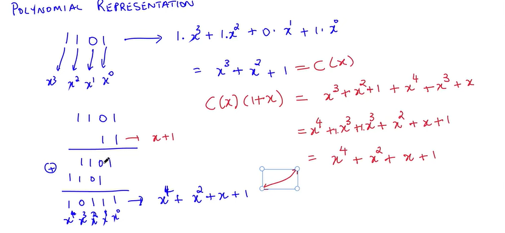
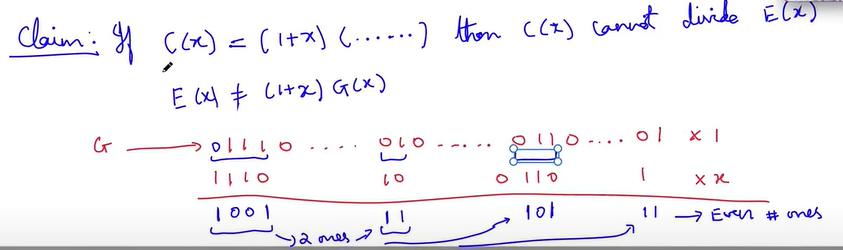

# DLL Layer
- The entire message is called a **"frame"**
CRC was:
1. Easy to generate
2. The message can be of any size

## Mathematics to help analyse CRC
1. Add and Subtract = XOR
2. each of the binary numbers has a polynomial reprsentation. 1101 would be represented as:

$$ 1.x^3 + 1.x^2 + 0.x + 1.x^0 $$

$$=  x^3 + x^2 + 1 $$

3. When we multiply, 1101 X 11 - we can directly multiply the polynomials (binary addition of coeffecients)

## How does Polynomial Repr. help?
- C(x) is the polynomial for the generator
1. Let codeword be represented by P(x)
2. Let's call the error bitstring E(x) - which would indicate only the erraneous bits as 1 rest (crrect bits) as 0

$$ P(x) = 10011...(1101) \ CRC \ is \ in \ (.)$$

And, say that the third bit from right is erraneous, then:

$$ E(x) = 00000...(0100)$$

3. What you receive is the sum of P(x) and E(x) (addition implemented using XORs)
4. Divide the received polynomial by C(x) and if the resulatant is 0, then we say that there is no error (**except the errors where we get a different valid codeword**)
5. We want:

$$ \frac{P(x) + E(x)}{C(x)} \neq 0 \ \ if \ E(x) \neq 0$$

6. this cannot happen always- but we want to analyse atleast which errors we can catch

## What errors can we catch?
1. **Single Bit Errors:**

$$ E(x) = x^i \ \ for \ some \ i ; \ i \ in\  \{0,1,...,n+k-1\}$$
- What should C(x) be to catch these type of errors?

$$ \frac{P(x) + E(x)}{C(x)} = \frac{P(x)}{C(x)} + \frac{E(x)}{C(x)} = \frac{E(x)}{C(x)} $$

   Due to the construction of C(x)
- If $ C(x) = x^k ... + 1 \ (k>1)$ then it can be shown that C(x) will not divide E(x) - **there might be other choices of C(x) to take care of detecting single bit errors but this form does the work**
If C(x) divides E(x) then:

$$ C(x).D(x) = E(x)  $$

$$ (x^k+...+1)(x^m +...x^q) = x^i \ for\  any\  m \geq q \geq 0$$

$$ x^{k+m} + ...+x^q = x^i$$

   Since k>1, $k+m > q$ therefore contradiction

2. **Two bit errors:**

$$ E(x) = x^j + x^i \ \ for \ some \ j > i ; \ i\ and \ j \ in\  \{0,1,...,n+k-1\}$$

$$ E(x) = x^i(x^{j-i} +1)$$

Write each polynomial as a product of irreducible polynomials

$$ \frac{E(x)}{C(x)} = \frac{g_1(x) g_2(x) ....g_t(x)}{f_1(x) f_2(x) ... f_m(x)}$$
    
- Suppose C(x) is of the form $x^k + ... + 1$, then no $f_l(x)$ is of the form $x^{\beta}$ for some $\beta$

$$ \frac{x^i(x^{j-i}+1)}{f_1(x) f_2(x) ... f_m(x)} $$

None of the $f_i(x)s$ are going to divide $x^i$, but $ (x^k + .. 1) $ can divide $x^{\gamma}+1$ for some large $\gamma = (j -i)$, which means that if j and i are far apart (the errors are far apart) C(x) may divide E(x) and error might go undetected
- Definition: For polynomial C(x), the **smallest $\gamma$** such that C(x) divides $x^{\gamma} +1$  is called the order of C(x) 
- **It is known that C(x) of the form $(x^k + ... +1)$ has order $2^k -1$** - if we fix k, then it limits the value of max length of message (codeword) that can be sent without error

3. **Odd number of errors:**
 
$$ E(x) = x^j + x^i ... \ odd \ number \ of \ terms $$

- Claim: if C(x) = $(1+x)(...)$ (has (1+x) as a factor) then C(x) cannot divide E(x)

- i.e. E(x) $\neq (1+x)G(x)$

- because (1+x) in denominator would never cancel
- also because one can never write any G(x) times (1+x) with odd number of 1s

- Claim: **If C(x) has an even number of terms then it will not divide E(x), which has odd number of terms** (super case of the previous claim)

4. Eg. HDLC uses CRC-16-IBM. C(x) = $x^{16} + x^{15} + x^2 +1$
5. CRC-32. C(x) = $x^{32} + x^{26} + x^{23} + x^{22} + x^{16} + x^{12} + x^{11} + x^{10} + x^8 + x^7 + x^5 + x^4 + x^2 + x + 1$
