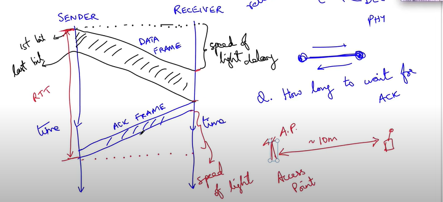
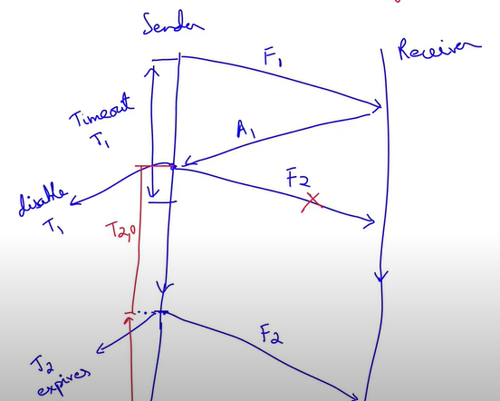
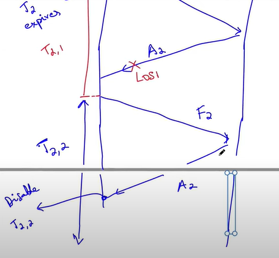
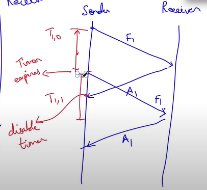
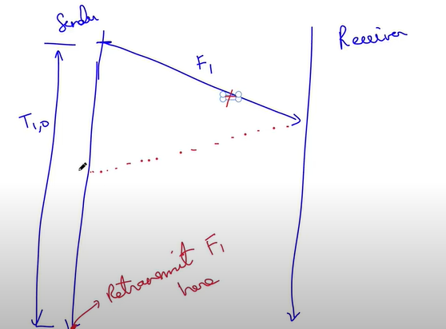
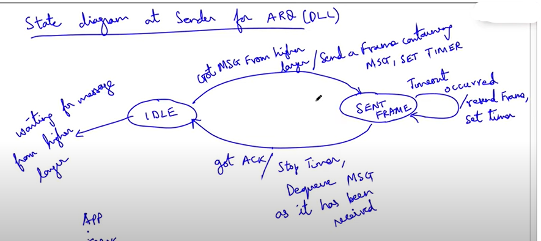

# CRC
## How to detect a burst of errors?
- Codeword (data|CRC)
- Due to some teporary disconnection of wire, there might be a burst of errors - some consecutive bits got flipped
- Say the burst was of length l 

$$ E(x) = x^{i+l-1} + .... + x^{l+1} + x^{i}$$

$$ E(x) = x^{i}(x^{l-1} + .... + x + 1)$$

Let C(x) = $x^k + ... + 1$ 

$$ \frac{E(x)}{C(x)} = \frac{x^i(x^{l-1} + ... + 1)}{x^k + ... + 1}$$

- $(x^k + ... + 1)$ has no factor of the form $x^p$ 
- If l-1 < k then C(x) cannot divide $(x^{l-1} + ... + 1)$

$$ (x^k + ... + 1)(...) = (x^{l-1} + ... + 1)$$

the LHS has power greater than or equal to k, which is strictly greater than l-1
- **Hence, bursts of length $l \leq k$ will be detected**

# ARQ - Automatic Repeat reQuest
- Deals with reliability
- **TCP and DLL** both handle reliability
- TCP is a little ineffecient in handling reliability - it takes time for the TCP to figure out whether a "segment" is lost or not
- It makes sense **for the DLL** to retransmit the message (frame) if it is erraneous
- Wifi uses ARQ

- How long to wait for the ACK (acknowledgement) frame

1. Case 1: When the Timeout is fine

2. Case 2: When the timeout is not suffecient

3. Case 3: When the timeout is very large

# State Diagrams
1. State: We are waiting for an event to occur - when it has occured we will jump to another state - eg. like resending the frame
- We can even stay in the same state

2. **(Event/ Action)** (written in the same format in the below diagram): Draw flowchart to express all the steps of the action to be taken

## What is the state diagram for the ARQ protocol (DLL)?

- Queue is just a buffer
